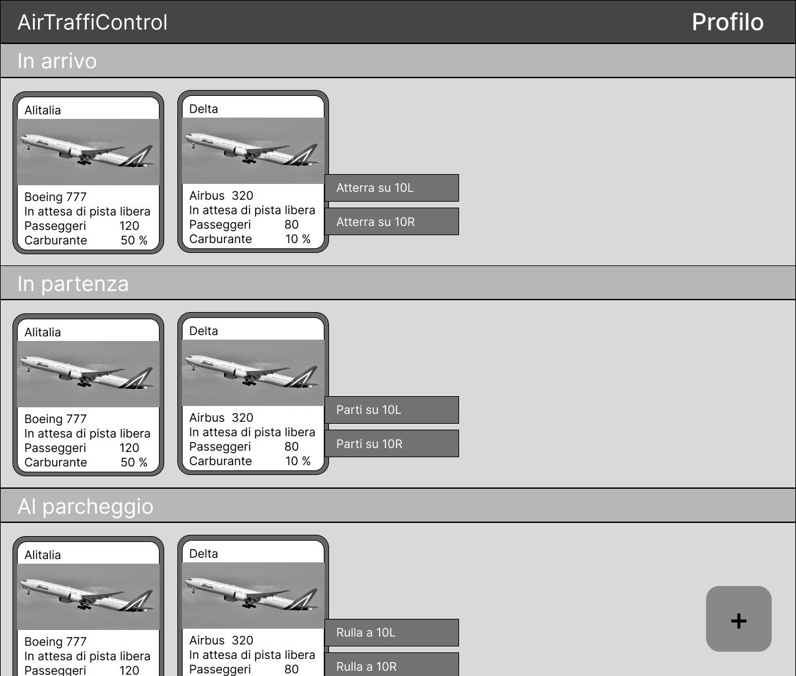
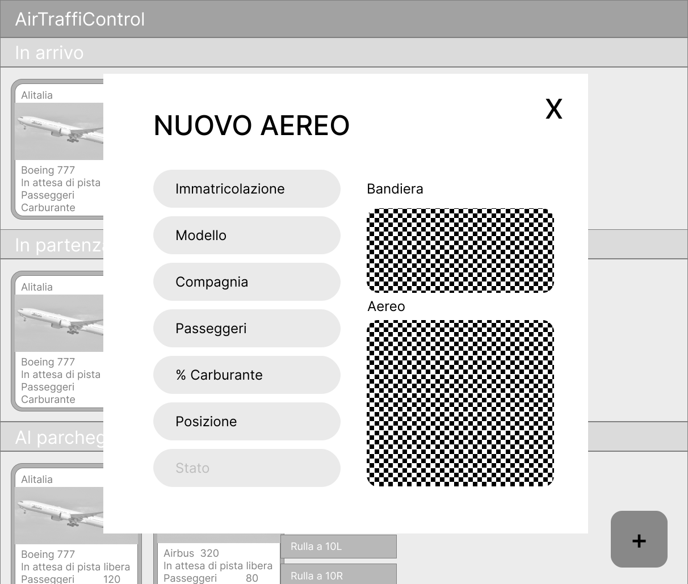
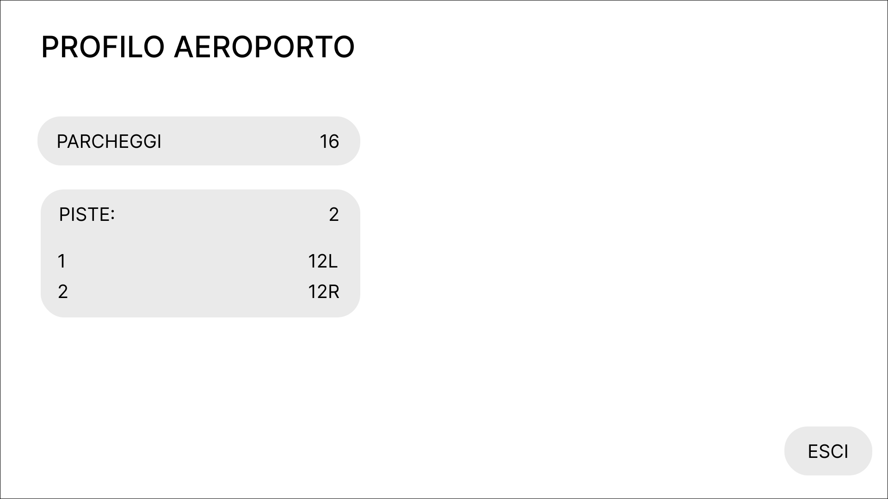
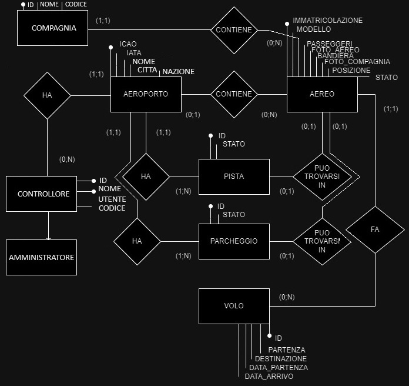

# AirTraffiControl
## Descrizione
Applicazione web per il controllo del traffico di uno spazio aereo con aeroporto: aerei generati manualmente, l'utente comanda ad essi l'azione da fare (atterrare, decollare, rullare al parcheggio, aspettare in coda, rifornirsi di carburante, passeggeri).
## Che problema risolve?
La lenta velocità che hanno i controllori di volo utilizzando dei fogli per annotarsi le informazioni che vanno spesso aggiornate, come la posizione, di ogni singolo volo.
## A chi è rivolta?
Alle torri di controllo di qualsiasi tipo di aereporto 
## Tecnologie usate
- HTML
- JavaScript
- mySQL
- PHP
## Funzionalità
* Aeroporto
  * Registazione dell'aeroporto direttamente con profilo amministratore
    * <a href="https://it.wikipedia.org/wiki/Codice_aeroportuale_ICAO">ICAO</a> e <a href="https://en.wikipedia.org/wiki/IATA_airport_code">IATA (se esistente)</a>
  * Parcheggi
    * Modifica numero
  * Piste
    * Modifica numero
* Aereo
  * Aggiunta manuale dei dati
    * <a href="https://it.wikipedia.org/wiki/Marche_d%27immatricolazione">Immatricolazione aereo</a>
    * Modello aereo
    * Compagnia
    * Foto aereo
    * Foto bandiera (automatico in base all'immatricolazione)
    * Posizione
    * Stato (automatico in base a posizione iniziale. Poi modificato in base alle azioni utente)
  * Modifica
  * Eliminazione
  * Comandi
    * Decolla su pista XX
    * Atterra su pista XX
    * Rulla verso pista XX
    * Rulla verso parcheggio XX
    * Rifornisciti di carburante
    * Fai scendere/salire le persone
* Controllori (utenti)
  * Accesso al profilo 
  * Uscita dal profilo
  * Recupero profilo se la password è stata smarrita
  * Aggiunta manuale dei dati
  * Modifica
  * Elimina

## Interfaccia
### Accesso

### Sala di controllo

### Aggiunta aereo

### Profilo


## Schema ER

## Relazioni
AEROPORTO (<ins>ICAO</ins>, IATA, NOME, CITTA, NAZIONE) <br>
CONTROLLORE (<ins>ID</ins>, <ins>NOME_UTENTE</ins>, CODICE, RUOLO, AEROPORTO_ICAO) <br>
AEREO (<ins>IMMATRICOLAZIONE</ins>, MODELLO, COMPAGNIA, FOTO_AEREO, BANDIERA, FOTO_COMPAGNIA, POSIZIONE, STATO, PISTA_ID, PARCHEGGIO_ID, AEROPORTO_ICAO) <br>

da eliminare!!!!!
PISTA (<ins>ID</ins>, STATO, AEROPORTO_ICAO) <br>
PARCHEGGIO (<ins>ID</ins>, STATO, <ins>AEROPORTO_ICAO</ins>) <br>

COMPAGNIA (<ins>ID</ins>, NOME, CODICE) <br>
## Creazione tabelle
```sql
DROP DATABASE IF EXISTS progetto;
CREATE DATABASE progetto;
USE progetto;
CREATE TABLE `aerei` (
    id int(11) NOT NULL auto_increment PRIMARY KEY,
    immatricolazione varchar(255) NOT NULL,
    modello varchar(255),
    compagnia varchar(255),
    foto_aereo varchar(255),
    foto_compagnia varchar(255),
    posizione varchar(255),
    stato varchar(255),
    pista_id int(11),
    parcheggio_id int(11),
    aeroporto_id varchar(255)
);
CREATE TABLE `aeroporti` (
    id int(11) NOT NULL auto_increment PRIMARY KEY,
    icao varchar(255) NOT NULL,
    iata varchar(255),
    nome varchar(255),
    citta varchar(255),
    nazione varchar(255)
);
CREATE TABLE `controllori` (
    id int(11) NOT NULL auto_increment PRIMARY KEY,
    nome_utente varchar(255) NOT NULL,
    nome varchar(255),
    cognome varchar(255),
    codice varchar(255),
    ruolo varchar(255),
    aeroporto_id varchar(255)
);
CREATE TABLE `luoghi` (
    id int(11) NOT NULL auto_increment PRIMARY KEY,
    nome varchar(255),
    tipo int(11),
    aeroporto_id varchar(255) NOT NULL
);
CREATE TABLE `voli` (
    id int(11) NOT NULL auto_increment PRIMARY KEY,
    codice varchar(255) NOT NULL,
    partenza varchar(255) NOT NULL,
    destinazione varchar(255) NOT NULL,
    data_partenza TIMESTAMP,
    data_arrivo TIMESTAMP
);
CREATE TABLE `compagnie` (
  id INT PRIMARY KEY,
  nome VARCHAR(50) NOT NULL,
  codice VARCHAR(3) NOT NULL
);
INSERT INTO `compagnie` (id, nome, codice) VALUES
(1, 'Qatar Airways', 'QTR'),
(2, 'Eurowings', 'EWG'),
(3, 'LOT Polish Airlines', 'LOT'),
(4, 'Etihad Airways', 'ETD'),
(5, 'All Nippon Airways', 'ANA'),
(6, 'Austrian Airlines', 'AUA'),
(7, 'American Airlines', 'AAL'),
(8, 'China Airlines', 'CAL'),
(9, 'Widerøe', 'WIF'),
(10, 'United Airlines', 'UAL'),
(11, 'Delta Air Lines', 'DAL'),
(12, 'Lufthansa', 'DLH'),
(13, 'Singapore Airlines', 'SIA'),
(14, 'Emirates', 'UAE'),
(15, 'Air France', 'AFR'),
(16, 'British Airways', 'BAW'),
(17, 'KLM', 'KLM'),
(18, 'Turkish Airlines', 'THY'),
(19, 'Cathay Pacific', 'CPA'),
(20, 'Swiss International Air Lines', 'SWR'),
(21, 'Air Canada', 'ACA'),
(22, 'Ryanair', 'RYR'),
(23, 'EasyJet', 'EZY'),
(24, 'Air China', 'CCA'),
(25, 'Japan Airlines', 'JAL'),
(26, 'Alitalia', 'AZA'),
(27, 'Iberia', 'IBE'),
(28, 'Qantas', 'QFA'),
(29, 'Air India', 'AIC'),
(30, 'Jet Airways', 'JAI'),
(31, 'Ethiopian Airlines', 'ETH'),
(32, 'Lion Air', 'LNI'),
(33, 'Southwest Airlines', 'SWA'),
(34, 'AirAsia', 'AXM'),
(35, 'Norwegian Air Shuttle', 'NAX'),
(36, 'SAS', 'SAS'),
(37, 'Finnair', 'FIN'),
(38, 'Thai Airways', 'THA'),
(39, 'Malaysia Airlines', 'MAS'),
(40, 'Garuda Indonesia', 'GIA'),
(41, 'Korean Air', 'KAL'),
(42, 'Asiana Airlines', 'AAR'),
(43, 'EVA Air', 'EVA'),
(44, 'LATAM Airlines', 'LAN'),
(45, 'Avianca', 'AVA'),
(46, 'Aeromexico', 'AMX'),
(47, 'Aerolineas Argentinas', 'ARG'),
(48, 'Gol Transportes Aéreos', 'GLO'),
(49, 'Azul Brazilian Airlines', 'AZU'),
(50, 'Copa Airlines', 'CMP'),
(51, 'Air New Zealand', 'ANZ'),
(52, 'Virgin Australia', 'VOZ'),
(53, 'Jetstar Airways', 'JST'),
(54, 'Hawaiian Airlines', 'HAL'),
(55, 'Alaska Airlines', 'ASA'),
(56, 'JetBlue Airways', 'JBU'),
(57, 'Spirit Airlines', 'NKS'),
(58, 'Frontier Airlines', 'FFT'),
(59, 'Volaris', 'VOI'),
(60, 'Interjet', 'AIJ'),
(61, 'Aeroflot', 'AFL'),
(62, 'S7 Airlines', 'SBI'),
(63, 'Ural Airlines', 'SVR'),
(64, 'Pobeda', 'PBD'),
(65, 'Air Europa', 'AEA'),
(66, 'Vueling', 'VLG'),
(67, 'TAP Air Portugal', 'TAP'),
(68, 'Aegean Airlines', 'AEE'),
(69, 'Olympic Air', 'OAL'),
(70, 'El Al', 'ELY'),
(71, 'Saudia', 'SVA'),
(72, 'EgyptAir', 'MSR'),
(73, 'Royal Air Maroc', 'RAM'),
(74, 'Kenya Airways', 'KQA'),
(75, 'South African Airways', 'SAA'),
(76, 'Vietnam Airlines', 'HVN'),
(77, 'Philippine Airlines', 'PAL'),
(78, 'China Southern Airlines', 'CSN'),
(79, 'China Eastern Airlines', 'CES'),
(80, 'Hainan Airlines', 'CHH'),
(81, 'Shenzhen Airlines', 'CSZ'),
(82, 'Xiamen Airlines', 'CXA'),
(83, 'IndiGo', 'IGO'),
(84, 'SpiceJet', 'SEJ'),
(85, 'GoAir', 'GOW'),
(86, 'Air Arabia', 'ABY'),
(87, 'Flydubai', 'FDB'),
(88, 'Indonesia AirAsia', 'AWQ'),
(89, 'Scoot', 'TGW'),
(90, 'AirAsia X', 'XAX'),
(91, 'Cebu Pacific', 'CEB'),
(92, 'WestJet', 'WJA'),
(93, 'Air Transat', 'TSC'),
(94, 'Sunwing Airlines', 'SWG'),
(95, 'Virgin Atlantic', 'VIR'),
(96, 'Condor', 'CFG'),
(97, 'TUI Airways', 'TOM'),
(98, 'Icelandair', 'ICE'),
(99, 'Wizz Air', 'WZZ'),
(100, 'Level', 'IBS');
```
## Come installare
Avviare un nuovo codespace, poi scrivere sul terminale:
```
docker run --name myXampp -p 41061:22 -p 41062:80 -d -v /workspaces/AirTraffiControl:/www tomsik68/xampp:8
```
Per avviare:
```
docker start myXampp
```
Collegarsi aprendo il link della porta 41062:80 
Accedere alla pagina di phpmyadmin, crea una nuova base di dati di nome "progetto" e inserire il codice SQL della sezione precedente per creare le tabelle.
Ora aggiungere alla fine dell'URL della porta la stringa "/www/PHP" per accedere all'index (esempio: https://esempio.app.github.dev/www/PHP)