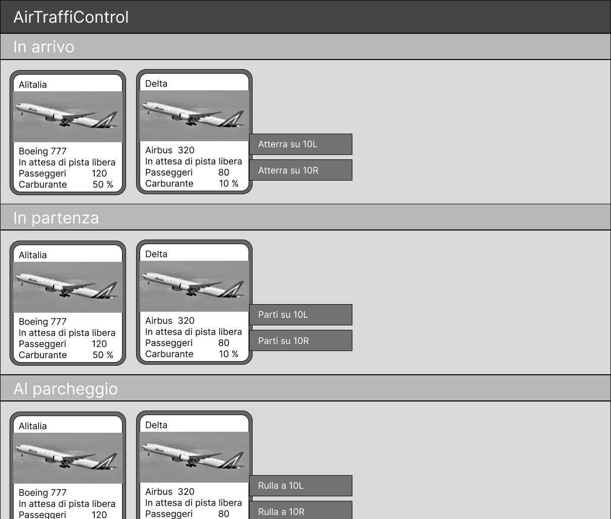
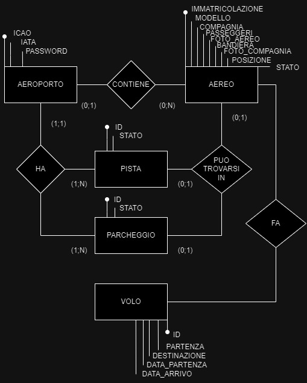

# AirTraffiControl
## Descrizione
Applicazione web per il controllo del traffico di uno spazio aereo con aeroporto: aerei generati casualmente o manualmente, l'utente comanda ad essi l'azione da fare (atterrare, decollare, rullare al parcheggio, aspettare in coda, rifornirsi di carburante, passeggeri).
## Che problema risolve?
La lenta velocità che hanno i controllori di volo utilizzando dei fogli per annotarsi le informazioni che vanno spesso aggiornate, come posizione e altitudine, di ogni singolo volo.
## Tecnologie usate
- HTML
- JavaScript
- mySQL
- PHP
## Funzionalità
* Aeroporto
  * Registazione del profilo dell'aeroporto
    * <a href="https://it.wikipedia.org/wiki/Codice_aeroportuale_ICAO">ICAO</a> o <a href="https://en.wikipedia.org/wiki/IATA_airport_code">IATA</a>
    * Password
  * Accesso al profilo 
  * Uscita dal profilo
  * Recupero profilo se la password è stata smarrita
  * Parcheggi
    * Modifica numero
  * Piste
    * Aggiungi
    * Modifica
    * Elimina
* Aereo
  * Aggiunta manuale dei dati
    * <a href="https://it.wikipedia.org/wiki/Marche_d%27immatricolazione">Immatricolazione aereo</a>
    * Modello aereo
    * Compagnia
    * Passeggeri
    * Percentuale di carburante
    * Foto aggiunta automaticamente in base al modello
    * Posizione
  * Aggiunta casuale
  * Modifica
  * Eliminazione
  * Comandi
    * Decolla su pista XX
    * Atterra su pista XX
    * Rulla verso pista XX
    * Rulla verso parcheggio XX
    * Rifornisciti di carburante
    * Fai scendere le persone
    * Fai salire le persone
## Interfaccia

## Schema ER

