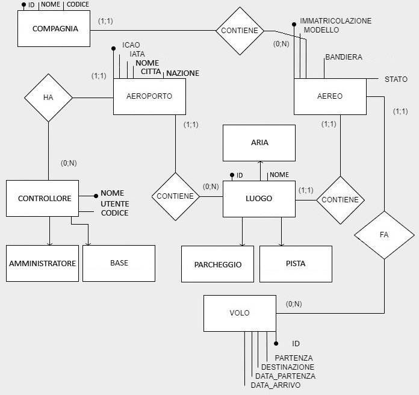

# AirTraffiControl
## Descrizione
Applicazione web per il controllo del traffico di uno spazio aereo con aeroporto: aerei generati casualmente o manualmente, l'utente comanda ad essi l'azione da fare (atterrare, decollare, rullare al parcheggio, aspettare in coda, rifornirsi di carburante, passeggeri).
## Che problema risolve?
La lenta velocità che hanno i controllori di volo utilizzando dei fogli per annotarsi le informazioni che vanno spesso aggiornate, come la posizione, di ogni singolo volo.
## A chi è rivolta?
Alle torri di controllo di qualsiasi tipo di aereporto 
## Tecnologie usate
- HTML
- JavaScript
- mySQL
- PHP
## Funzionalità
* Aeroporto
  * Registazione dell'aeroporto direttamente con profilo amministratore
    * <a href="https://it.wikipedia.org/wiki/Codice_aeroportuale_ICAO">ICAO</a> e <a href="https://en.wikipedia.org/wiki/IATA_airport_code">IATA (se esistente)</a>
  * Parcheggi
    * Modifica numero
  * Piste
    * Aggiungi
    * Modifica
    * Elimina
* Aereo
  * Aggiunta manuale dei dati
    * <a href="https://it.wikipedia.org/wiki/Marche_d%27immatricolazione">Immatricolazione aereo</a>
    * Modello aereo
    * Compagnia
    * Passeggeri
    * Percentuale di carburante
    * Foto aereo
    * Foto bandiera (automatico in base all'immatricolazione)
    * Posizione
    * Stato (automatico in base a posizione iniziale. Poi modificato in base alle azioni utente)
  * Aggiunta casuale
  * Modifica
  * Eliminazione
  * Comandi
    * Decolla su pista XX
    * Atterra su pista XX
    * Rulla verso pista XX
    * Rulla verso parcheggio XX
    * Rifornisciti di carburante
    * Fai scendere/salire le persone
* Volo
  * Aggiunta manuale dei dati
  * Modifica
  * Elimina
* Controllori (utenti)
  * Accesso al profilo 
  * Uscita dal profilo
  * Recupero profilo se la password è stata smarrita
  * Aggiunta manuale dei dati
  * Modifica
  * Elimina

## Interfaccia
### Accesso

### Sala di controllo

### Aggiunta aereo

### Profilo


## Schema ER

## Relazioni
AEROPORTO (<ins>ICAO</ins>, IATA, NOME, CITTA, NAZIONE) <br>
CONTROLLORE (<ins>ID</ins>, <ins>NOME_UTENTE</ins>, CODICE, RUOLO, AEROPORTO_ICAO) <br>
AEREO (<ins>IMMATRICOLAZIONE</ins>, MODELLO, COMPAGNIA, PASSEGGERI, FOTO_AEREO, BANDIERA, FOTO_COMPAGNIA, POSIZIONE, STATO, PISTA_ID, PARCHEGGIO_ID, AEROPORTO_ICAO) <br>
PISTA (<ins>ID</ins>, STATO, AEROPORTO_ICAO) <br>
PARCHEGGIO (<ins>ID</ins>, STATO, AEROPORTO_ICAO) <br>
VOLO (<ins>ID</ins>, PARTENZA, DESTINAZIONE, DATA_PARTENZA, DATA_ARRIVO, AEREO_ID) <br>
## Creazione tabelle
```sql
CREATE TABLE `aerei` (
    immatricolazione varchar(255) NOT NULL PRIMARY KEY,
    modello varchar(255),
    compagnia varchar(255),
    passeggeri int(11),
    foto_aereo varchar(255),
    foto_compagnia varchar(255),
    posizione varchar(255),
    stato varchar(255),
    pista_id int(11),
    parcheggio_id int(11),
    aeroporto_icao varchar(255)
)
CREATE TABLE `aeroporti` (
    icao varchar(255) NOT NULL PRIMARY KEY,
    iata varchar(255),
    nome varchar(255),
    citta varchar(255),
    nazione varchar(255)
)
CREATE TABLE `controllori` (
    nome_utente varchar(255) NOT NULL PRIMARY KEY,
    nome varchar(255),
    cognome varchar(255),
    codice varchar(255),
    ruolo varchar(255),
    aeroporto_icao varchar(255)
)
CREATE TABLE `parcheggi` (
    id int(11) NOT NULL PRIMARY KEY,
    stato varchar(255),
    aereopoto_icao varchar(255)
)
CREATE TABLE `piste` (
    id int(11) NOT NULL PRIMARY KEY,
    stato varchar(255),
    aereopoto_icao varchar(255)
)
CREATE TABLE `voli` (
    id int(11) NOT NULL PRIMARY KEY,
    partenza varchar(255),
    destinazione varchar(255),
    data_partenza timestamp,
    data_arrivo timestamp,
    aereo_immatricolazione varchar(255)
)
```
##Come installare
DA IMPLEMENTARE!!!!!!!!!!!!!!!!!!!!!!!!!!!!!!!!!!!!!!!!!!!!!!!!!!!!!!!!!!!!!!!!!!!!!!!!!!!!!!!!!!!!!!!!!!!!!!!!!!!!!!!!!!!!!!!!!!!!!!!!!!!!!!!!!!!!!!!!!!!!!!!!!!!!!!!!!!!!!!!!!!!